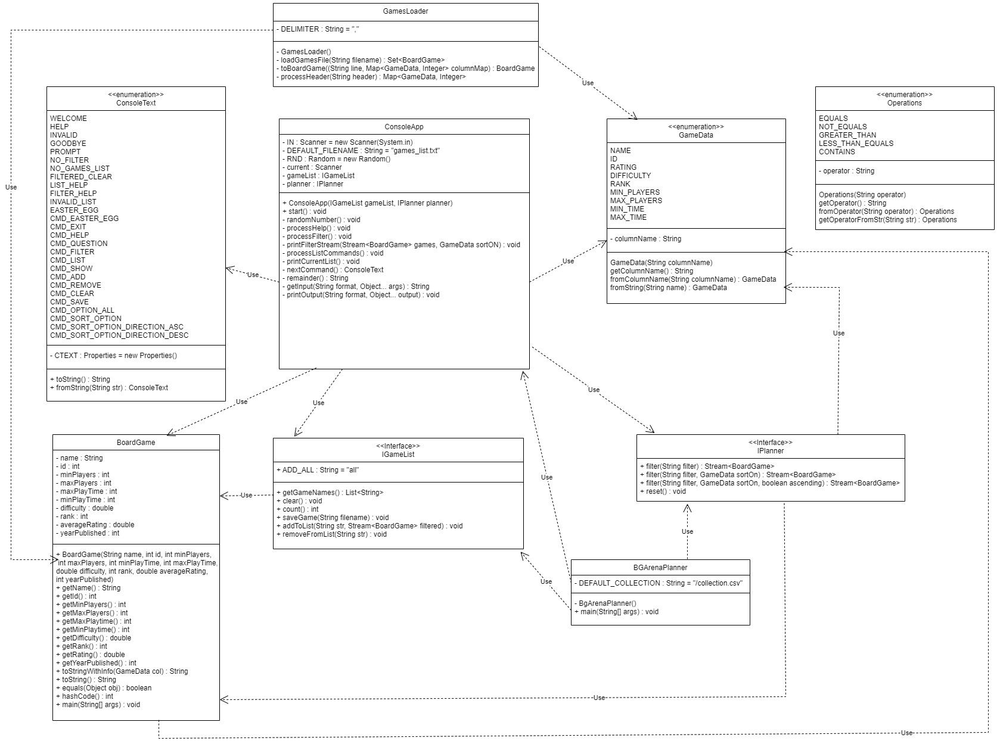
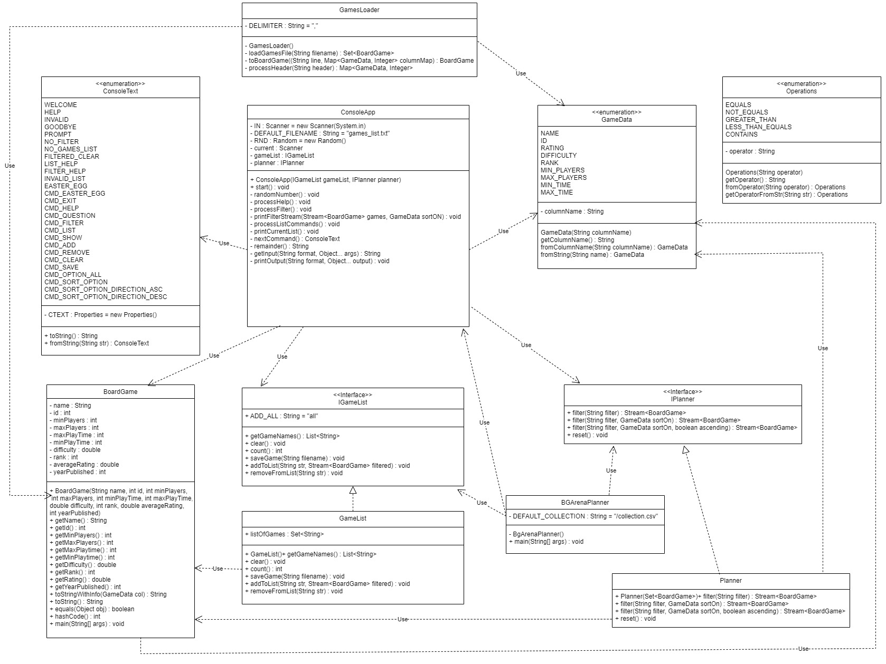

# Board Game Arena Planner Design Document

This document is meant to provide a tool for you to demonstrate the design process. You need to work on this before you code, and after have a finished product. That way you can compare the changes, and changes in design are normal as you work through a project. It is contrary to popular belief, but we are not perfect our first attempt. We need to iterate on our designs to make them better. This document is a tool to help you do that.

## (INITIAL DESIGN): Class Diagram 

Place your class diagrams below. Make sure you check the file in the browser on github.com to make sure it is rendering correctly. If it is not, you will need to fix it. As a reminder, here is a link to tools that can help you create a class diagram: [Class Resources: Class Design Tools](https://github.com/CS5004-khoury-lionelle/Resources?tab=readme-ov-file#uml-design-tools)

### Provided Code

Provide a class diagram for the provided code as you read through it.  For the classes you are adding, you will create them as a separate diagram, so for now, you can just point towards the interfaces for the provided code diagram.

### Your Plans/Design

Create a class diagram for the classes you plan to create. This is your initial design, and it is okay if it changes. Your starting points are the interfaces. 

## (INITIAL DESIGN): Tests to Write - Brainstorm

Write a test (in english) that you can picture for the class diagram you have created. This is the brainstorming stage in the TDD process. 

> [!TIP]
> As a reminder, this is the TDD process we are following:
> 1. Figure out a number of tests by brainstorming (this step)
> 2. Write **one** test
> 3. Write **just enough** code to make that test pass
> 4. Refactor/update  as you go along
> 5. Repeat steps 2-4 until you have all the tests passing/fully built program

You should feel free to number your brainstorm. 

1. testAddSingleGameByIndex(): adds a game to the list using a specific index. Check if the game is added to the list.
2. testAddRangeOfGames(): adds a range of games by index. Checks if range of games are added to the list.
3. testGetGameNames(): tests that it returns the list of game names in ascending order.
4. testClear(): tests that it clears the entire games list.
5. testCount(): tests that it counts the correct number of games in the list.
6. testSaveGame(): tests that the file is saved and is the correct data. Also tests for when the file is overwritten.
7. testAddAllGames(): tests if all the games in the filtered list are added to the games list.
8. testAddGameByName(): Adds a game by name and tests if it is added to the game list.
9. testRemoveGameByName(): Tests if game is able to be removed by name from the games list.
10. testRemoveAll(): Tests if all games are removed from the game list.
11. testRemoveRangeOfGames(): removes a range of games by index. Checks if range of games are removed from the list.
12. testFilter(): Tests if results are returned in ascending order.
13. testFilterAsc(): Tests if results are returned in ascending order as specified
14. testFilterDesc(): Tests if results are returned in descending order as specified.
13. testFilterPlayers(): Tests for filtering of min and max players, including range of players, using: >,<,>=,<=,==,!=.
14. testFilterPlaytime(): Tests for filtering of playtime, including range of playtime, using: >,<,>=,<=,==,!=.
15. testFilterByName(): Tests for filtering by name or if the name is included in the games
16. testFilterRank(): Tests for filtering of ranks, including range of ranks, using: >,<,>=,<=,==,!=.
17. testFilterRating(): Tests for filtering of ratings, including range of ratings, using: >,<,>=,<=,==,!=.
18. testFilterDifficulty(): Tests for filtering of difficulty, including range of ranks, using: >,<,>=,<=,==,!=.
19. testFilterYear(): Tests for filtering of year, including range of year, using: >,<,>=,<=,==,!=.

## (FINAL DESIGN): Class Diagram

Go through your completed code, and update your class diagram to reflect the final design. Make sure you check the file in the browser on github.com to make sure it is rendering correctly. It is normal that the two diagrams don't match! Rarely (though possible) is your initial design perfect. 

For the final design, you just need to do a single diagram that includes both the original classes and the classes you added. 

> [!WARNING]
> If you resubmit your assignment for manual grading, this is a section that often needs updating. You should double check with every resubmit to make sure it is up to date.

## (FINAL DESIGN): Reflection/Retrospective

> [!IMPORTANT]
> The value of reflective writing has been highly researched and documented within computer science, from learning to information to showing higher salaries in the workplace. For this next part, we encourage you to take time, and truly focus on your retrospective.

Take time to reflect on how your design has changed. Write in *prose* (i.e. do not bullet point your answers - it matters in how our brain processes the information). Make sure to include what were some major changes, and why you made them. What did you learn from this process? What would you do differently next time? What was the most challenging part of this process? For most students, it will be a paragraph or two. 
